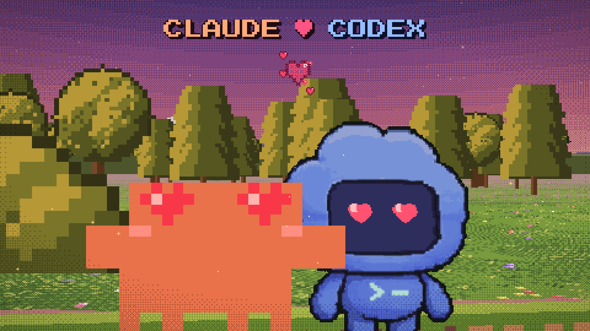

# Claude vs Codex — a pixel-art cartoon written entirely in code

Generated by the new Claude Opus in Claude Code — **one-shot, 1 user turn**, ~5.5 hours of wall-clock time.



A 93-second, 1080p, 30 fps cartoon about Clawd (the Claude Code mascot) and the Codex pet: they
argue over who is better, duel in code, race, get caught in the rain, make up and watch the sunset.

There is no video editor, no After Effects and no image generation here. Every frame is computed by
~15 000 lines of Python + NumPy that Claude wrote in one turn: a tiny pixel engine, a
Mode-7-style 2.5D camera, eight scenes, a chiptune synth and a mixer. The complete result — picture,
sound design, music, credits, cover and English version — was made as a one-shot.

<details>
<summary>One-shot prompt</summary>

> make a cool cartoon 16:9. make it with code.
>
> in the cartoon - clawd (the claude code mascot, pull him out of the bundles and the claude app)
> and codex (the codex pet, pull him out of the codex app pets too)
>
> well basically the vid is like they at first argue like I'm better, no I'm better. and then by the end they make up and sit cute at sunset hugging. different scenes.
>
> world is pixel so make both of them fit in nicely (they’re both pixel), you can generate the world background and stuff and elements via fal if you want, or you can do it yourself.
>
> make it in 2.5d. with sounds and music. no voiceover. you can use subagents.

</details>

## Build it

macOS, Python 3.10+, `ffmpeg`, `node` (for `npx`), and the Claude and ChatGPT desktop apps installed
(the character sprites are taken from *your* copies — see below).

```bash
pip install -r requirements.txt
./make.sh                    # Russian version  -> out/claude_vs_codex_ru.mp4
LANG_CARTOON=en ./make.sh    # English version  -> out/claude_vs_codex_en.mp4
```

Rendering takes about two minutes on an M-series Mac (8 worker processes). The output is
pixel-identical to the published video — `tools/compare.py a.mp4 b.mp4` checks that.

Handy while poking around:

```bash
python3 render.py timing                                                  # scene timeline
python3 render.py stills --scene s7_sunset --times 3,9,15 --out s7.png     # a few frames
python3 render.py sheet  --scene s4_race --step 0.5 --out race.png         # contact sheet
```

## How it works

| file | what it is |
|---|---|
| `px.py` | the "engine": 480×270 float canvas, sprite blits, ordered dithering, pixel fonts, particles, RU→EN strings |
| `cam3d.py`, `worlds.py` | SNES Mode 7 / HD-2D style perspective floor, billboards, depth sorting, ready-made worlds |
| `chars.py` | the two actors: frame atlases, poses, blinking, squash & stretch |
| `bg.py` | palettes, skies, meadow layers, props |
| `scenes/s0…s7` | the eight scenes; each is a pure function of time `render(t) → frame`, so frames render in parallel and in any order |
| `render.py` | timeline, transitions (iris, flash, dissolve), parallel render, x264 encode at 4× nearest-neighbour |
| `audio/` | chiptune synth, music, three SFX passes, mixer/master. `audio/PLAN.md` is the sound-design brief the agents worked from |
| `tools/fetch_assets.sh` | collects the mascots' official art and slices it into a clean 1 px = 1 unit grid |
| `dev/` | the agents' raw working files — QA contact sheets, benchmarks, the sample-library pipeline. Kept as is, paths and all, for the curious |

The main agent wrote the engine first, then three sub-agents wrote the scenes in parallel (the
`_a_`, `_b_`, `_c_` helper files are their private toolboxes). The main agent reviewed contact sheets
and sent out small fix-up agents — one redrew a leaf umbrella, another fixed the shots where Clawd had
lost his legs. Sound went the same way: one agent for music, three for effects, two collecting free
sample libraries, one planning density and priorities.

## Session stats

**Turns: 1 (one-shot).** The requests below are internal API calls by Claude and its sub-agents,
not additional user turns.

Counted from the `usage` fields of all 13 session transcripts (the main agent plus 12 sub-agents),
de-duplicated per API message.

| | requests | output | cache write | cache read | API-equivalent cost |
|---|--:|--:|--:|--:|--:|
| Main agent | 234 | 0.37M | 1.28M | 58.4M | $51 |
| 12 sub-agents | 944 | 1.77M | 6.72M | 243.9M | $208 |
| **Total** | **1,178** | **2.14M** | **8.0M** | **302.3M** | **≈ $259** |

- **Volume:** about 312M tokens in total, of which only 2.4K were uncached input — 97% is cache reads,
  i.e. one long context re-read 1,178 times.
- **Where $259 comes from:** the token counts priced at the public API rates for Claude Opus 5
  ($5 input / $25 output, cache writes $6.25 (5 min) and $10 (1 h), cache reads $0.50 per 1M tokens).
  The session itself ran on a Claude Code subscription, so this is an API-equivalent figure, not money
  actually spent.
- **Time:** 17:45 → 23:34, 5 h 49 min of wall-clock time; the finished picture took 3 h 53 min of that.

## Sound

The repo ships the final mixed soundtrack (`audio/soundtrack.m4a`) and the full code that produced
it. Rebuilding the soundtrack from scratch additionally needs a ~1000-file library of free samples
(Kenney, OpenGameArt, Tone.js, archive.org). The scripts that built it are in `dev/sound_library/`,
but they were an exploratory one-off, not a reproducible pipeline — treat them as documentation.

## About the characters

Clawd belongs to Anthropic and the Codex pet belongs to OpenAI. This is an unofficial fan work, not
affiliated with or endorsed by either company, and **their source artwork is not in this repository**
(the cover above is a rendered frame): `tools/fetch_assets.sh` downloads Clawd's GIFs from claude.ai and extracts the Codex spritesheet and
Clawd's laptop animation from the apps installed on your own machine.

## Licence

Code — [MIT](LICENSE). Soundtrack — CC BY-SA 4.0, sources in [CREDITS.md](CREDITS.md).
Characters — their respective owners.

Prompt by kirill sh · Telegram [@shneural](https://t.me/shneural)
